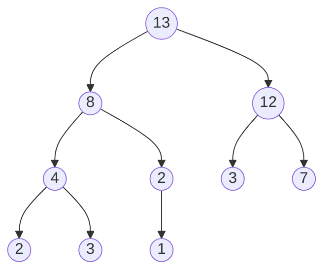

# Partie III - Structure de Données

# Chapitre 15 : Fiches de Priorités

## I - Tas Binaire

Soit X un ensemble ordonné

<u>Définition</u> : Un tas binaire est un arbre binaire presque complet ayant la propriété de tas. 

> Presque complet : tous les étages sont pleins sauf éventuellement le dernier qui est alors "rempli de gauche à droite" (voir exemple).
> 
> Propriété de tas :
> 
> * Tas-max : un élément de l'arbre est plus grand que ses (deux) fils.
> 
> * Tas-min : un élément est plus petit que ses fils.

Voyons un exemple.



<u>Important</u> : Dans le dernier étage "il n'y a pas de trou", si un nœud de l'étage h-1 n'a pas deux enfants, alors tous les nœuds à sa droite n'ont pas d'enfant.

> Remarque : appellation tas-max car le max est à la racine

### Implémentation des Tas Binaires

#### Tableau

Ceci est possible justement parce que l'arbre est presque complet. Si un noeud est stocké en case $i$ du tableau, alors son fils gauche se trouve en case $2i+1$ et son fils droit en $2i+2$.

On place la racine en case 0.

<u>Sur l'exemple</u>

| 0   | 1   | 2   | 3   | 4   | 5   | 6   | 7   | 8   | 9   |
|:---:|:---:|:---:|:---:|:---:|:---:|:---:|:---:|:---:|:---:|
| 13  | 8   | 12  | 4   | 2   | 3   | 7   | 2   | 3   | 1   |

> Remarque : Cela correspond à un parcours en largeur.

<u>Opérations</u>

* Ajouter un élément au tas

* Supprimer la racine

##### 1. Ajout

Pour simplifier on suppose avoir des tableaux dynamiques.

###### Algorithme auxiliaire

On aura besoin d'une opération auxiliaire : `percolate_up`.

Spécification `percolate_up` :

* Précondition : l'arbre manipulé est presque un tas : il y a au plus un nœud qui pose problème ; il est plus grand que son père.

* Postcondition : l'arbre est un tas binaire qui contient les mêmes éléments qu'au départ.

```md
Algorithme percolate_up :
Tant que le noeud "pointé" pose problème
    Echanger ce noeud avec son père
```

<u>Correction</u> : Lors d'un échange, le nœud qui prend la place de son père est plus grand que son frère gauche par transitivité. La preuve est assez évidente, la précondition est vérifiée : il y a au plus un problème dans l'arbre, entre l'élément remonté et son nouveau père.

<u>Complexité</u> : A chaque étape le nœud pointé remonte d'un étage, donc l'algorithme est en O(h(t)). Sauf qu'ici, soit n le nombre d'éléments) comme l'arbre est presque complet, on a : $2^{h(t)}-1 <n\le 2^{h(t)+1}-1$

Donc $h(t)$ ~ $log(n)$

<u>Autre façon de le voir</u>

Si un nœud se trouve en case $i$ du tableau, son père est en case $\frac{i-1}{2}$ du tableau. Donc notre algorithme a pour variant la quantité $log_2(i+1)$ donc une complexité $O(log_2(i+1))$.

###### Algorithme principal

On ajoute un élément en dernière case du tableau (que l'ont étend si nécessaire) et on appelle `percolate_up` sur ce dernier nœud.

#### 2. Suppression de la racine

<u>Algorithme</u>

* On remplace a racine par l'élément le plus à droite dans le tableau

* On appelle `percolate_down`

<u>Algorithme `percolate_down`</u>

```markdown
Tant que le noeud pointé pose problème
    On échange le noeud avec le plus grand de ses fils
```

Précondition / Invariant de boucle : L'arbre est un tas sauf éventuellement au niveau du nœud pointé.

<u>Complexité</u> : $O(h(t)) = O(log(n))$

## II - Tri Par Tas

<u>Deux étapes</u>

1) On transforme le tableau initial en un tas

2) On extrait successivement le max et on le range à sa place

<u>Exemple</u> : $a=\{13,8,1,7,18,4,0,12\}$

1. Invariant de boucle : $a[0:i+1]$ est un tas
   
   $i=0$ : <u>13</u> 8 1 7 18 4 0 12
   
   $i=1$ : <u>13</u> <u>8</u> 1 7 18 4 0 12
   
   $i=2$ : <u>13</u> <u>8</u> <u>1</u> ...
   
   $i = 3$ : <u>13</u> <u>8</u> <u>1</u> <u>7</u> 18 ... 
   
   $i = 4$ : <u>18</u> <u>13</u> <u>1</u> <u>7</u> <u>8</u> 4 0 12 (flèche de 8 à 13 puis à 18)
   
   $i=5$ : <u>18</u> <u>13</u> <u>4</u> <u>7</u> <u>8</u> <u>1</u> 0 12 (flèche de 1 à 4)
   
   $i=6$ : <u>18</u> <u>13</u> <u>4</u> <u>7</u> <u>8</u> <u>1</u> <u>0</u> 12
   
   $i=7$ : <u>18</u> <u>13</u> <u>4</u> <u>12</u> <u>8</u> <u>1</u> <u>0</u> <u>7</u> (flèche de 7 à 12 et de 12 à 13)
   
   Pour $i=0$ à $n-1$ : `percolate_up(i)`
   
   Complexité : Chaque `percolate(i)` est en $O(log(i)) \le O(log(n))$ donc le total est en $O(nlog(n))$.

2. Extraction du max (on remplace 7 et 18) puis on effectue `percolate_down`
   
   Invariant : $a[0:i]$ est un tas binaire et $a[i:n]$ est trié et contient des éléments supérieurs à ceux de $a[0:i]$.
   
   Algorithme :
   
   ```markdown
   Pour i = n à 1
       Échanger a[0] et a[i-1]
       taille du tas -= 1
       percolate_down(0)
   ```
   
   Complexité : $O(nlog(n))$

<u>Conclusion</u> : Complexité temporelle en $O(nlog(n))$ et spatiale en $O(1)$

## III - Files de Priorités

<u>Définition</u> : **Structure abstraite** qui permet de stocker des éléments munis d'une priorité.

<u>Opérations</u>

* Créer une file de priorité vide

* Ajouter un élément et sa priorité dans la file

* Extraire l'élément de priorité dans la file

* Tester si la file est vide

* Déterminer le minimum de la liste

* Mettre à jour une priorité pour la remplacer par une priorité plus faible

### 1. Implémentations naïves

|                             | Min         | Extract Min | Update Prio | Add         |
|:---------------------------:|:-----------:|:-----------:|:-----------:|:-----------:|
| Tableaux triés par priorité | $O(1)$      | $O(1)*$     | $O(n)$      | $O(n)$      |
| Liste chaînée non triée     | $O(n)$      | $O(n)$      | $O(1)$      | $O(1)$      |
| ABR équilibré               | $O(log(n))$ | $O(log(n))$ | $O(log(n))$ | $O(log(n))$ |

*On note * l'utilisation d'un tableau dynamique*


### 2. Implémentation via les tas binaires

<u>Créer une file vide</u> : on crée un tas vide

<u>File vide</u> : facile

<u>Trouver le minimum</u> : il faut utiliser un `tas-min`  $O(1)$

<u>Extraire le minimum</u> : cela correspond à la suppression de la racine d'un tas binaire $O(log(n))$

<u>Ajout d'un élément</u> : ajout dans un tas binaire $O(log(n))$

<u>Mise à jour d'une priorité</u>

* On met à jour la priorité

* Si la nouvelle priorité est inférieure à l'ancienne on appelle `percolate_up` $O(log(n))$
  
  Sinon, on appelle `percolate_down` $O(log(n))$


### 3. Remarque importante sur l'implémentation

Dans les tas binaires, les nœuds contiennent une valeur dans un ensemble X donné (c'est un `'a tas_binaire`).

Ici, les étiquettes des nœuds sont des couples `(élément, priorité)`, la priorité joue le rôle de clé et l'élément de donnée satellite.

La clé sert donc à structurer le tas, c'est elle qui est utilisée dans les fonctions de tas (insertion, suppression...) tandis que la donnée satellite n'est pas lue. 

Cependant, pour la mise à jour d'une priorité, on souhaiterait avoir une fonction

```c
void update_priority (tas, elt, new_prio);
```

<u>Solution naïve</u> : on cherche l'élément dans le tas pour mettre à jour la seconde composante du couple puis on appelle `percolate` depuis le nœud $O(n)$.

<u>Solution préférable</u> : On représente une file de priorité par un couple

* tas binaire de couples

* dictionnaire dont les clés sont les éléments (la donnée satellite) et dont les valeurs sont les indices du tableau qui implémente le tas où se trouve la priorité de l'élément concerné.

Conséquence : à chaque modification du tableau dans les fonctions de tas binaire il faut mettre à jour le dictionnaire.


